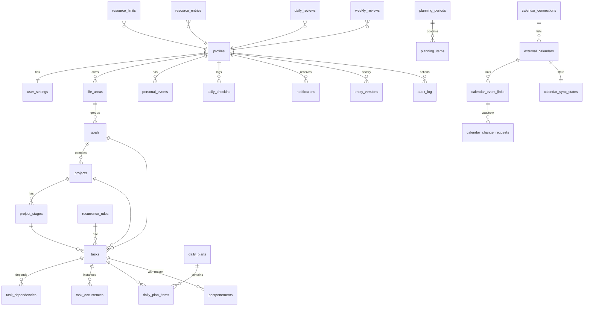

# Модель данных

Все пользовательские таблицы содержат `user_id` и защищены RLS (`auth.uid() = user_id`).
Метки времени — `timestamptz` (UTC). Деньги — `numeric(14,2)`. Миграции: `supabase/migrations/`.

## ER-диаграмма (основные сущности)

## Группы таблиц

- **Идентичность/настройки**: `profiles`, `user_settings`.
- **Иерархия**: `life_areas`, `goals`, `projects`, `project_stages`.
- **Задачи**: `tasks`, `task_dependencies`, `recurrence_rules`, `task_occurrences`, `personal_events`.
- **Планирование/ресурсы**: `planning_periods`, `planning_items`, `daily_checkins`, `daily_plans`,
  `daily_plan_items`, `resource_limits`, `resource_entries`.
- **Ритм/итоги**: `daily_reviews`, `weekly_reviews`, `postponements`, `notifications`.
- **Календари**: `calendar_connections`, `external_calendars`, `calendar_event_links`,
  `calendar_sync_states`, `calendar_change_requests`.
- **История**: `entity_versions`, `audit_log`.

## Ключевые ограничения

- Зоны фокуса — enum `focus_zone`; статусы — enum `task_status`.
- Циклические зависимости задач запрещены триггером `prevent_task_dependency_cycle`.
- `postponements.reason` обязателен (перенос всегда с причиной).
- Не более одного календаря по умолчанию для исходящих (частичный уникальный индекс).
- Профиль и настройки создаются автоматически при регистрации (`handle_new_user`).
